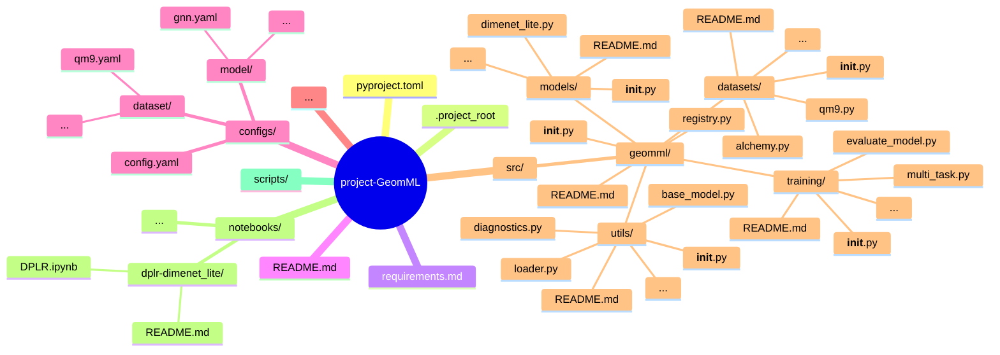

# GeomML Framework

Фреймворк для реализации исследовательских проектов в рамках направления `GeomML` в `Deep Learning School (DLS)`. 

Фреймворк находится на стадии разработки. Структура проекта, моделей и общая реализация может меняться.

## 1. Структура проекта




## 2. Система Hydra (configs + executor) 
позволяет как производить запуски на удаленных машинах, облачных серверах или кластерах.

Помимо базовых запусков: `python train.py`, данная система позволяет:
* Менять модель без кода: `python train.py model=egnn_gap`
* Выбирать dataset: `python train.py dataset=qm9 model=egnn`
* Менять гиперпараметры: `python train.py model.emb_dim=256 model.depth=6`
* Менять optimizer: `python train.py optimizer.lr=3e-4 optimizer.weight_decay=1e-6`
* Менять batch size: `python train.py data.batch_size=64`
* Перекрывать всё сразу: `python train.py model=egnn_gap model.depth=8 optimizer.lr=1e-4 data.batch_size=128`
* Можно делать sweep’ы
* Hydra multirun (автоматически grid search): 
```python train.py -m model.emb_dim=64,128,256```
или 
```python train.py -m optimizer.lr=1e-3,3e-4,1e-4```


TODO # Чего поделать дальше (production-grade вариант):
* logging через WandB / MLflow / W&B / TensorBoard
* automatic checkpoint resume
* config versioning
* experiment tracking
* distributed training (DDP)
* config composition (DeepMind / FAIR стиль)
* metrics registry
* trainer class (Lightning-style без Lightning)
* multi-GPU
* OpenMMLab / PyG / DeepMind-style codebase

## 3. Aналогичные modular ML Framework systems
* PyG + DeepChem style 
* DeepMind 
* Open Catalyst style

##  4. TODO

1. доделать до уровня "clean modular ML system":
* Encoder registry (Geom, TDA, SMILES, etc.)
* automatic shape inference
* zero hardcoding dims
* config-driven architecture
* plug-and-play modalities

2. рассмотреть “production-grade” pipeline:
* typed dataclasses вместо dict
* automatic batching + padding molecules
* multi-task loss routing (dipole/polar/tda)
* dataset config system (YAML style)
* unified trainer (one loop for all datasets) - реализовано.
